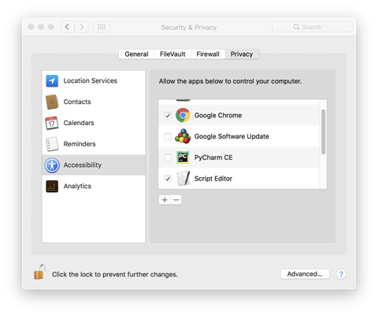

# csv2keychain
This AppleScript that will read a CSV file containing URL, username and password data and import this to iCloud KeyChain via Safari. If you want import data from 1Password, please export to csv with the layout below.

* This version works on macOS High Sierra 11.13.1

## CSV Layout
Create a CSV without headers with data in the below order, set the data without quotation marks.
>url,username,password

For example, import an entry for the user tzungtzu at kindle.com.
>kindle.com,tzungtzu,654332

## Accessibility Permissions
Script editor must be given permission under System Preferences - Security & Privacy - Accessibility to run. Ensure you remove this after you have finished running the script.

